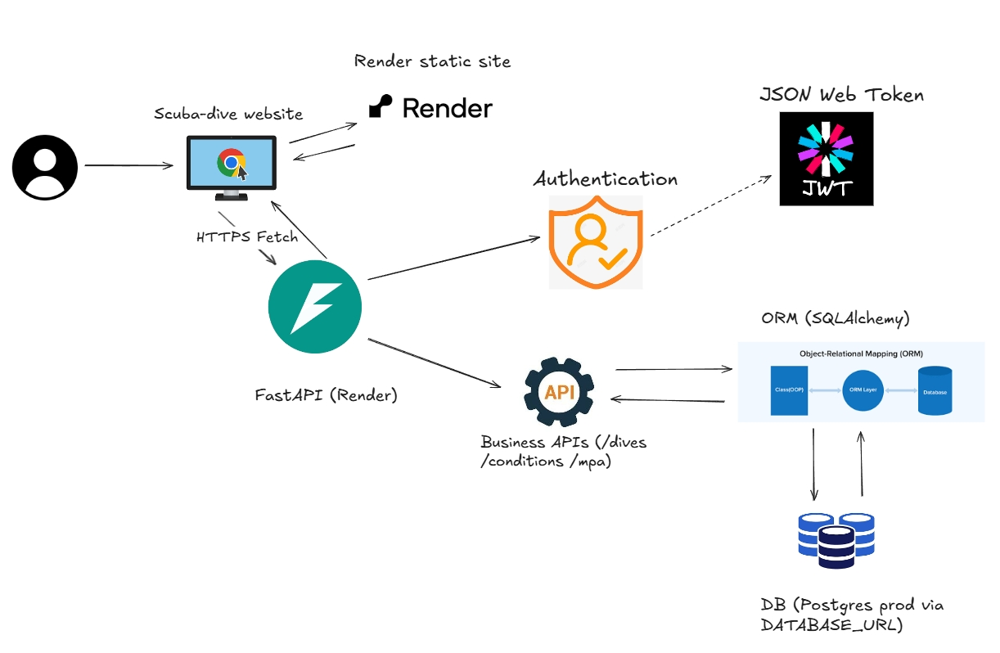

# Scuba Dives — Personal Dive Log & Sea Conditions

A lightweight, full-stack app to **log my dives**, **check sea/weather conditions**, and **warn about Marine Protected Areas (MPAs)** around planned sites. Frontend is a static site; backend is a FastAPI service with cookie-based JWT auth.

---

## Table of Contents
1. [About the Project](#about-the-project)  
2. [Live Demo](#live-demo)  
3. [Built With](#built-with)  
4. [Features](#features)  
5. [Architecture](#architecture)  

---

## About the Project
I am a frequent **scuba diver** and wanted one place to:  
- **Log dives** with details I care about (site, depth, gas, water temp, buddy, notes, photos later).  
- **Check conditions quickly** (wind, visibility, wave height/period, precipitation) before choosing a site/date.  
- **Stay compliant** by getting a heads-up if a point falls **inside an MPA** (Marine Protected Area).  

This repo contains a simple static frontend and a typed FastAPI backend with **secure, HttpOnly cookie** authentication (access + refresh) so my logs remain private. It’s designed to be easy to host on **Render** (or any Docker platform) with an S3-hosted GeoJSON for MPA polygons and Open-Meteo for weather/marine data.

---

## Live Demo
- **API (FastAPI docs)**: [scuba-dives API](https://scuba-dives-page.onrender.com)

---

## Built With
- 
- 
- 
- 
- 
- 
- 
- 
- 
- 
- 
- 
- 
- 

---

## Features
- 🔐 **Auth**: Register/Login, `access_token` + `refresh_token` as **HttpOnly cookies** with automatic refresh on 401.  
- 📒 **Dive Log**: Create and list personal dive entries (site, country, date, max depth, visibility, gas, tank, weight, water temp, suit, buddy, operator, notes, rating…).  
- 🌊 **Conditions**: Geocode → fetch daily/hourly **weather + marine** forecasts (wind, wave height/period, visibility, cloud, precip, water temperature).  
- 🪸 **MPA Alert**: Given `lat/lon`, warn if the point lies **inside an MPA polygon** (S3 GeoJSON).  
- 🧭 **Credentialed fetch**: Frontend uses `fetch(..., { credentials: 'include' })` to carry cookies cross-origin.  
- 🧱 **Single-image Docker**: Gunicorn + Uvicorn worker; healthcheck; works on Render out-of-the-box.  

---

## Architecture

